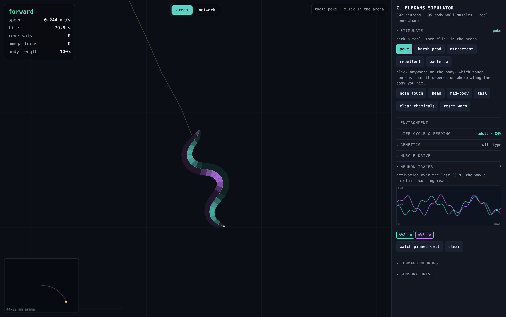
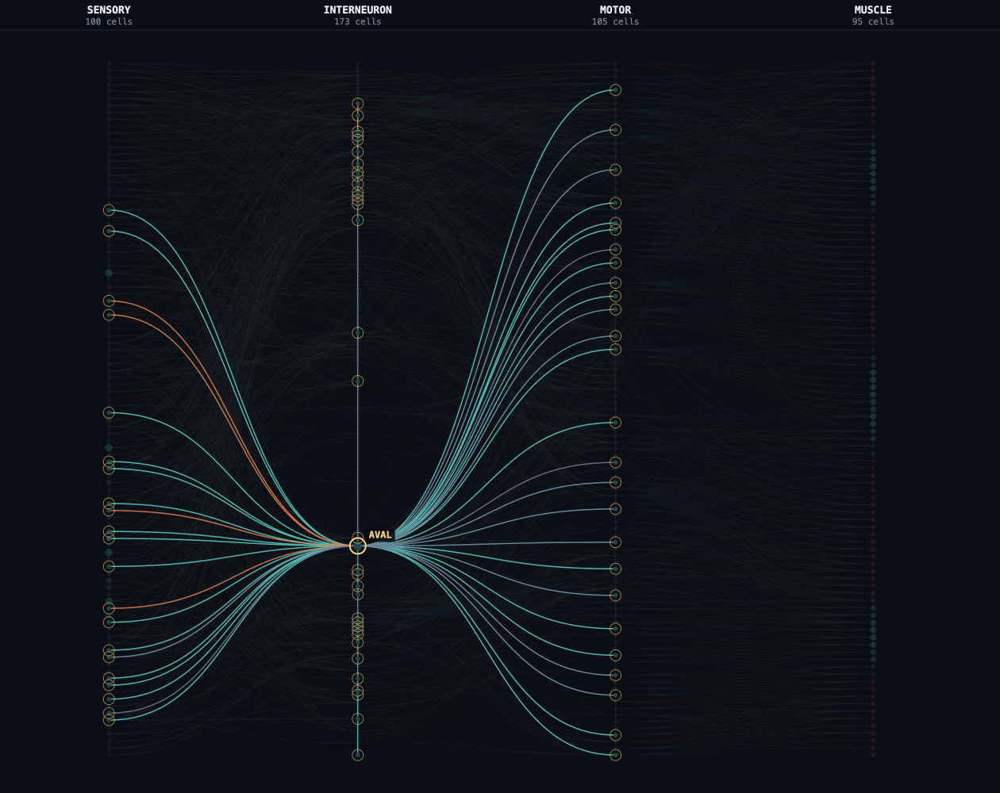

# celeganssim

A whole-organism simulator for *Caenorhabditis elegans*.

It simulates all 300 neurons and 95 body-wall muscles over the published
electron-microscopy connectome, drives a biomechanical body through a viscous
medium, and runs the animal from a fertilised egg through four larval stages to
senescence and death. You can poke it anywhere on its body, knock out genes by
name, laser-ablate individual neurons, and run the standard behavioural assays.



*Teal is dorsal muscle, purple is ventral. The alternation running down the body
is the undulatory wave that moves the animal.*

---

## Install and run

```bash
git clone https://github.com/vdmkenny/celeganssim && cd celeganssim
python -m venv .venv && .venv/bin/pip install -e .
.venv/bin/python scripts/fetch_data.py     # downloads ~43 MB, then builds
.venv/bin/worm serve                       # http://127.0.0.1:8080
```

Requires Python 3.10+ and **numpy**. The viewer is standard library and vanilla
JavaScript, with no build step. Datasets are not redistributed here:
`fetch_data.py` pulls each from its publisher, verifies it, and builds the
processed files.

The connectome is Cook et al.'s corrected July 2020 release, published as an
Excel workbook and read by `scripts/xlsx.py`, a standard-library reader added
so the project keeps its numpy-only dependency. The 2019 edgelist and the
White et al. 1986 file are downloaded for comparison and are not used to build
anything.

```bash
worm serve            # live browser viewer
worm validate         # 38 checks against published measurements, in parallel
worm params           # audit every model parameter and its provenance
worm assay all        # run the standard behavioural assays
worm gene unc-25      # look up a locus
worm info             # genome and connectome summary
worm export run.csv --seconds 120 --neuron AVAL
worm batch --genotype wild-type --genotype unc-25 --replicates 5
```

---

## What it does

### Mechanosensation

Touch is a position along the body. The six touch receptor neurons tile the
animal with overlapping graded receptive fields, so where you prod it determines
which cells respond. Anterior touch drives reversal, posterior touch drives
forward acceleration, and mid-body touch falls where the ALM and PLM fields
cross over and is unreliable. These follow from the connectome rather than from
rules: PLM has no chemical output at all, reaching the forward command
interneuron PVC purely through gap junctions.

Harsh touch (100-200 uN) is a separate channel. FLP covers the head and is
reversal-biased in the wiring; PVD tiles the rest of the body and favours
forward. Both are MEC-4 independent, so harsh responses survive in `mec-4`
mutants.

### Genetics

Thirty-one loci are mapped onto the subsystems their products implement.
Knockouts reach only the cells that CeNGEN single-cell RNA-seq measures the gene
in:

| Gene | Expressed in | Effect |
|---|---|---|
| `mec-4` | the six touch receptor neurons | gentle touch abolished, harsh touch intact |
| `unc-25` | 28 cells: DD, VD, RME, AVL, DVB, RIS, RIB | GABA lost, animal hypercontracts |
| `che-1` | ASEL, ASER | salt chemotaxis lost, odour intact |
| `cat-2` | the eight dopaminergic neurons | basal slowing on food lost |
| `daf-2` | 158 cells | lifespan roughly doubles, requires `daf-16` |

`worm gene <name>` resolves any of the 46,926 annotated loci to its WormBase ID,
chromosome and coordinates.

### Neuron ablation

Alt-click any cell in the network view to kill it: it stops sending and
receiving, and the surviving network's resting state is re-solved around the
loss.

| Ablation | Result |
|---|---|
| AVB + PVC | forward drive falls to 0.00, reversals intact |
| AVA + AVD + AVE | touch-evoked reversal abolished |
| ALM + AVM | anterior touch sensitivity lost |

### Network view



All 448 cells laid out sensory to interneuron to motor to muscle, ordered to
minimise edge crossings, with node brightness tracking live drive. Hover any
cell for its transmitter, current drive and strongest partners with weights.
Pin it, or watch it in the trace panel to see its activation over the last 30
seconds.

### Life cycle

Runs from fertilised egg to death on measured timings: 14.2 h of embryogenesis
with milestones, 50.7 h from hatch to adult across four larval stages, dauer
entry under crowding and scarcity, a sperm-limited brood of ~300 over ~5 days,
then senescence and death at a lifespan that scales with temperature and
genotype.

### Assays

Each reports the metric its original paper reports and carries that paper's
reference value.

| Assay | Measures |
|---|---|
| `chemotaxis` | chemotaxis index on a salt gradient |
| `thermotaxis` | drift relative to remembered cultivation temperature |
| `touch-habituation` | response decrement over repeated taps |
| `basal-slowing` | speed drop on encountering food |
| `touch-response` | reversal probability by body position |
| `lifespan` | egg to death, with brood size and reproductive period |

### Data export

CSV or JSON of trajectory, behavioural state, developmental stage and named
neuron activations, with fixed seeds. `worm batch` compares genotypes across
replicates.

---

## How it works

```
Environment      gradients, bacterial lawn, temperature, oxygen, touch
      |
SensorySystem    modality -> named neurons, via receptive fields, gated by genes
      |
NervousSystem    448 cells, graded-potential ODEs over the real connectome
      |
Simulation       reads command interneurons -> behavioural state machine
      |
Muscle pacer     the one scripted current -> 95 REAL muscle cells
      |
Body             muscle calcium -> force -> viscoelastic body
      |
                 resistive force theory -> movement -> back to Environment
```

*C. elegans* neurons do not spike; they are isopotential, graded-release cells.
The model is the standard leaky-integrator formulation of Wicks et al. (1996)
and Kunert et al. (2014):

```
C dV_i/dt = -G_leak(V_i - E_leak,i) - I_gap_i - I_syn_i + I_ext_i
I_gap_i   = sum_j g_gap * Gg[i,j] * (V_i - V_j)
I_syn_i   = sum_j g_syn * Gs[i,j] * s_j * (V_i - E_ij)
ds_j/dt   = a_r * phi(V_j) * (1 - s_j) - a_d * s_j
```

Integration is exponential Euler, unconditionally stable, at roughly 4x real
time on a laptop. The per-cell activation threshold is solved as a linear system
so the resting network sits at its own equilibrium. Passive properties follow
patch clamp: a 0.25 nS leak for a 4 GOhm input resistance, and 3 pS per
gap-junction contact, since measured coupling is reported whole-cell across all
contacts a pair shares. Leak reversals are solved so the network equilibrium
lands on measured resting potentials.

The 95 body-wall muscles are cells in the same network and carry their own
measured passive properties: they rest at -25 mV against a neuron's -65 mV,
have a capacitance of 70 pF against 1.5 pF, and a membrane time constant of
70 ms against 6 ms. The depolarised rest reflects a high chloride permeability
rather than a potassium equilibrium.

Muscle force follows calcium rather than membrane potential, so each muscle
carries a calcium stage: two first-order filters whose combined impulse
response is the measured transient, rising with a 250 ms and decaying with an
880 ms time constant and peaking 0.44 s after excitation. Contractile calcium
in this animal comes from sarcoplasmic release through the ryanodine receptor
UNC-68 gated by EGL-19. Calcium here is normalised drive, not a concentration:
no C. elegans muscle calcium measurement has ever been calibrated to nM or uM.

At the neuromuscular junction, acetylcholine acts on a non-selective cation
channel reversing near 0 mV and GABA on the chloride-permeant UNC-49 receptor
reversing near -30 mV, so against a -25 mV resting potential GABA contributes
5 mV of hyperpolarising drive and acts largely by shunting. The per-contact
neuromuscular conductance is calibrated so that a muscle's achievable
whole-cell cholinergic conductance matches the 8.5 nS measured by patch clamp.
Achievable rather than nominal matters here: the synaptic release variable
cannot exceed a_r/(a_r + a_d), so a synapse delivers at most a sixth of its
per-contact conductance and spans only 1.83x from rest to saturation.

Muscle fires all-or-none calcium action potentials, and those spikes are what
drive contraction. The inward conductance is measured twice over: Jospin's
peak EGL-19 density of 199 S/F at 70 pF gives 13.9 nS, and the measured
maximum upstroke rate of 1.38 V/s across 70 pF needs 9.2 nS against the 8.9 nS
the steady-state density gives. Inactivation is partial, and its residual is
measured too, the maintained component being 127 S/F of the 199 S/F peak. The
repolarising side is fitted, since neither SHK-1 nor SLO-2 has a published
body-wall muscle current-voltage relation; it is fitted to the measured
waveform, reproducing a 45.6 mV spike of 18.7 ms half-width against a measured
45 to 53 mV and 15.5 to 20 ms.

| Module | Role |
|---|---|
| `worm/genome.py` | annotation, gene lookup, knockouts, expression |
| `worm/connectome.py` | wiring to conductance matrices, network layout |
| `worm/nervous_system.py` | graded-potential dynamics, ablation |
| `worm/sensory.py` | environment to current, mechanosensory receptive fields |
| `worm/body.py` | oscillator, muscle to curvature, low-Reynolds locomotion |
| `worm/kinematics.py` | gait measurement: frequency, wavelength, wave direction |
| `worm/lifecycle.py` | embryo, larval stages, dauer, feeding, ageing, death |
| `worm/simulation.py` | closed loop, escape-response state machine |
| `worm/assays.py` | standard assays with reference values |
| `worm/validate.py` | 38 checks: 25 behavioural, 13 consistency, gaps as expected failures |
| `worm/parameters.py` | audited parameter registry, provenance tags enforced by a check |
| `worm/server.py`, `viewer/` | live browser viewer |

---

## Data

| Dataset | Source | Contents |
|---|---|---|
| Genome annotation | NCBI RefSeq GCF_000002985.6 (WBcel235) | 46,926 genes, 19,983 protein-coding |
| Connectome | Cook et al., corrected July 2020 release, via OpenWorm ConnectomeToolbox | 473 cells, 7,762 edges (302 neurons, 95 body-wall muscles) |
| Neuron metadata | OpenWorm owmeta | type and transmitter for 302 neurons |
| Expression | CeNGEN via wormneuroatlas | 128 neuron classes x 13,669 genes |
| Cell classification | WormAtlas | lineage and anatomical class |
| Receptor pharmacology | derived from RefSeq product descriptions | 72 ligand-gated receptors with ion selectivity |

The datasets disagree in specific ways, each handled in code where it arises:
gap junctions are listed in both directions, so the matrix is filled directly
rather than symmetrised; cell naming differs between sources and is normalised;
owmeta leaves 57 neurons unannotated, which come from the systematic transmitter
atlases; and cells that stain GABA-positive but lack `unc-25` take GABA up
rather than making it, so are not modelled as GABAergic.

---

## Validation

`worm validate` runs 38 checks against published measurements: 25 behavioural
(the animal is run and measured) and 12 consistency checks (parameter and data
invariants). 29 pass. Nine are registered expected failures, each naming the
gap it tracks. The connectome does not generate the locomotor rhythm, so real
muscle drive carries no undulation, and the fixed-frequency oscillator cannot
adapt gait to the medium
([issue #10](https://github.com/vdmkenny/celeganssim/issues/10)). Without
spontaneous reversals there are no pirouettes, so chemotaxis cannot
discriminate salt-blind mutants, and `goa-1` loses to constant reversing the
speed its deeper, faster bends would otherwise gain
([issue #6](https://github.com/vdmkenny/celeganssim/issues/6)). Muscle
activation also leads curvature by 8 degrees where the animal holds about 45.

| Check | Model | Published |
|---|---|---|
| Input resistance | 4.0 GOhm | 1.6 to 8 GOhm |
| Membrane time constant | 6.0 ms | 3 to 10 ms |
| AVAL-AVAR gap coupling | 54 pS | 56 pS |
| VA5 / VB6 resting potential | -71.7 / -53.2 mV | -71.7 / -53.2 mV |
| Crawling speed | 0.239 mm/s | 0.20 +/- 0.04 mm/s |
| Undulation amplitude | 21.2% body length | 19.3% |
| Embryogenesis | 14.2 h | 14.2 h |
| Hatch to adult | 50.8 h | 50.67 +/- 1.95 h |
| Adult lifespan | mean 15.9 d, sd 3.3 d over a cohort | 15.2 +/- 3.6 d |
| Self-fertile brood | 300 | ~327, sperm-limited |
| `daf-2` lifespan | 31.3 d (2x the animal's own draw) | ~29.5 d |

The other behavioural checks cover touch responses by body position, the
`mec-4`/`mec-10` dissociation, the `unc-25`/`unc-47`/`unc-49` shrinker class,
`unc-13` paralysis, the opposing `goa-1` and `egl-30` phenotypes, `tdc-1`
omega-turn loss, and command-interneuron ablation. The consistency checks pin
the `daf-16` epistasis, `che-1` modality gating, developmental timings, and
the sperm-limited brood.

Every parameter the model is told is collected in one audited registry
(`worm params`), tagged measured, published, tuned or scripted; the scripted
tags are the ones the open issues exist to delete.

Independently, the 26 GABAergic neurons the pipeline derives from transmitter
data match the known count exactly (6 DD + 13 VD + 4 RME + AVL + DVB + RIS).

---

## Scope and limitations

**Measured data:** connectivity and synapse counts, transmitter identity, gene
expression, receptive field extents, passive membrane properties, resting
potentials, developmental timings, body sizes, brood size, lifespan.

**Standard published models:** graded-potential dynamics (Wicks 1996 / Kunert
2014), resistive force theory for low-Reynolds locomotion.

**Approximations:**

- **The locomotor rhythm is imposed, not emergent, and it is imposed at the
  end organ.** No published model produces this rhythm from the connectome and
  no ventral cord motor neuron has ever been recorded during locomotion, so
  one scripted current carries the wave: per-muscle currents into the 95 real
  muscle cells, at the measured frequency and wavelength (Cronin et al. 2005),
  switching direction with the command state as B- and A-class activity does
  (Haspel et al. 2010; Kawano et al. 2011). Everything downstream is real:
  muscle calcium with measured kinetics, force, mechanics, so ablating muscle
  bends the animal and GABA loss produces the shrinker through genuine
  co-contraction (McIntire et al. 1993). Imposing the rhythm one level higher,
  as currents into the motor neurons, was built and measured out: the current
  leaks into the command interneurons through their measured gap junctions
  and destroys touch discrimination, with mec-4 reading as wild type on every
  detector tried. Imposing it one level lower, as prescribed body curvature,
  leaves the muscles decorative. The end organ is the smallest scripted
  surface that keeps every assay readable, and
  [docs/emergent-cpg.md](docs/emergent-cpg.md) records the attempts to shrink
  it further.
- **Muscle spikes are not reached from synaptic input.** Muscle carries the
  measured calcium action potential, but crossing its -10 mV threshold needs
  about 2.4 nS of extra excitatory conductance, close to the 2.26 nS implied
  by the measured 67.9 pA trigger current, and one junction spans only 1.83x
  from rest to saturation. Propagation along the body is therefore still
  subthreshold and graded rather than spike-mediated, which is why an imposed
  bend propagates at slope 0.364 rather than the measured 0.62.
  [docs/emergent-cpg.md](docs/emergent-cpg.md) sets out what an emergent version
  requires. No published model produces C. elegans locomotion emergently from
  the connectome.
- **Synapse signs are derived per edge** from the postsynaptic cell's measured
  receptor expression (CeNGEN): which ligand-gated channels a cell transcribes,
  and whether those are cation or anion channels, sets each synapse's sign.
  The receptor table itself is derived from the RefSeq product descriptions
  (`scripts/build_receptors.py`). Where expression cannot decide (metabotropic
  transmitters, cells outside CeNGEN, ties), a transmitter-level heuristic is
  the tagged fallback. A small table of documented exceptions overrides both
  where behaviour settles a sign that expression cannot: PLM onto the backward
  command interneurons is inhibitory, since tail touch drives forward escape
  and PLM ablation abolishes it, and acetylcholine gates chloride through the
  ACC and LGC families that CeNGEN does not resolve in those cells. Overrides
  are counted separately in the sign provenance.
- **The genome sequence is not load-bearing.** The annotation drives gene lookup
  and knockouts, but the 100 Mb of sequence yields chromosome lengths and GC
  content. Mapping a gene to what its loss *does* is a curated table.
- **Escape is a state machine.** Reversal and omega turn have separable motor
  pathways; the network decides when each fires.
- **The 24-segment body is a coarse-graining.** The animal has 95 body-wall
  muscles in quadrants of 24/24/24/23, staggered into eight longitudinal rows
  rather than transverse rings, which Hall notes amounts to roughly twelve
  segments. Muscle index is mapped proportionally onto segments, preserving
  anterior-posterior order without claiming a ring. The 4x24 grid some
  simulators use is an idealisation, not anatomy.
- **Innervation is treated as uniform along the body, and is not.** The
  anterior 16 muscles receive nerve-ring input only, the next 16 receive both
  ring and cord, and only the posterior 63 are on the cord alone (White et al.
  1986). The head is a separate oscillator in the animal, and muscle arms reach
  only the nearest cord, which is the structural reason the body is restricted
  to dorsoventral waves.
- **The posterior body is the reconstruction's thinnest region, and it is
  where the wave has to travel.** Muscles in body rows 17 to 24 average 6.3
  presynaptic partners against about 10 published, while head and neck sit at
  10.0 and 12.8, and sublateral input to posterior muscle is absent entirely.
  Cook et al. report a remaining gap "in a region of the posterior body where
  there are no high-power EM series from either sex", and state that gaps
  leaving cells without innervation are "unquestionably artefactual". A
  wiring-derived model cannot propagate a wave through a region the wiring is
  missing from, so part of the locomotion gap is a limit of the available data
  rather than of the model.
- **About 29% of neuromuscular input in the dataset was never
  EM-reconstructed.** The sublateral motor neurons (SMB, SMD, SIA, SIB) were
  recorded by immunofluorescence and sampling rather than serial section, and
  White et al. reported almost no synapses on those processes. Muscle-muscle
  gap junctions are similarly incomplete, carrying almost no left-right
  coupling where White describes it through the muscle arms.
- **Not modelled:** pharynx, gonad, intestine, embryonic lineage, hydrodynamics
  beyond RFT. One animal, so crowding is a scalar.

---

## References

**Connectome**
- White, Southgate, Thomson & Brenner (1986), Phil. Trans. R. Soc. B 314:1
- [Cook et al. (2019), Nature 571:63](https://doi.org/10.1038/s41586-019-1352-7)
- [Witvliet et al. (2021), Nature 596:257](https://doi.org/10.1038/s41586-021-03778-8)
- [OpenWorm ConnectomeToolbox](https://github.com/openworm/ConnectomeToolbox) · [c302](https://github.com/openworm/c302) · [owmeta](https://github.com/openworm/owmeta)

**Neural dynamics and electrophysiology**
- [Wicks, Roehrig & Rankin (1996), J. Neurosci. 16:4017](https://doi.org/10.1523/JNEUROSCI.16-12-04017.1996)
- [Kunert, Shlizerman & Kutz (2014), Phys. Rev. E 89:052805](https://doi.org/10.1103/PhysRevE.89.052805)
- Goodman, Hall, Avery & Lockery (1998), Neuron 20:763 (input resistance, capacitance)
- [Liu, Chen & Wang (2014), Nat. Commun. 5:5155](https://doi.org/10.1038/ncomms6155) (motor neuron resting potentials)
- [Liu, Chen & Wang (2020), Nat. Commun. 11:5076](https://doi.org/10.1038/s41467-020-18893-9) (gap junction conductance)
- [Shindou et al. (2019), Sci. Rep. 9:3430](https://doi.org/10.1038/s41598-019-40158-9)
- [Jospin et al. (2002), J. Cell Biol. 159:337](https://doi.org/10.1083/jcb.200203055) (calcium reversal; muscle resting potential -19.7 mV and input resistance 1.0 GOhm)
- [Gao & Zhen (2011), PNAS 108:2557](https://doi.org/10.1073/pnas.1012346108) (muscle resting potential -25.0 mV, calcium action potentials, 67.9 pA trigger current)
- [Richmond (2006), WormBook](https://doi.org/10.1895/wormbook.1.112.1) (neuromuscular junction recording; muscle capacitance ~70 pF)
- [Richmond & Jorgensen (1999), Nat. Neurosci. 2:791](https://doi.org/10.1038/12160) (one GABA and two acetylcholine receptors at the NMJ; 774 pA acetylcholine response, chloride-permeant UNC-49)
- [C. elegans Neural Interactome](https://github.com/shlizee/C-elegans-Neural-Interactome)

**Transmitters and expression**
- [Pereira et al. (2015), eLife 4:e12432](https://doi.org/10.7554/eLife.12432) (cholinergic)
- [Serrano-Saiz et al. (2013), Cell 155:659](https://doi.org/10.1016/j.cell.2013.09.052) (glutamatergic)
- [Gendrel, Atlas & Hobert (2016), eLife 5:e17686](https://doi.org/10.7554/eLife.17686) (GABAergic)
- [Taylor et al. (2021), Cell 184:4329](https://doi.org/10.1016/j.cell.2021.06.023) (CeNGEN)
- [Randi et al. (2023), Nature 623:406](https://doi.org/10.1038/s41586-023-06683-4) (wormneuroatlas)

**Locomotion**
- [Boyle, Berri & Cohen (2012), Front. Comput. Neurosci. 6:10](https://doi.org/10.3389/fncom.2012.00010)
- [Wen et al. (2012), Neuron 76:750](https://doi.org/10.1016/j.neuron.2012.08.039) (proprioceptive coupling)
- [Haspel, O'Donovan & Hart (2010), J. Neurosci. 30:11151](https://doi.org/10.1523/JNEUROSCI.1494-10.2010) (B-class active in forward, A-class in backward locomotion)
- [Kawano et al. (2011), Neuron 72:572](https://doi.org/10.1016/j.neuron.2011.09.005) (A/B activity balance sets direction)
- [McIntire, Jorgensen, Kaplan & Horvitz (1993), Nature 364:337](https://doi.org/10.1038/364337a0) (GABA loss produces the shrinker)
- [Sulston & White (1980), Dev. Biol. 78:577](https://doi.org/10.1016/0012-1606(80)90353-X) (muscle ablation causes local body-shape defects)
- [Mellem, Brockie, Madsen & Maricq (2008), Nat. Neurosci. 11:865](https://doi.org/10.1038/nn.2131) (RMD plateau potentials, a measured regenerative response in a head motor neuron)
- [Byerly, Cassada & Russell (1976), Dev. Biol. 51:23](https://doi.org/10.1016/0012-1606(76)90119-6) (development rate versus temperature)
- [Gao et al. (2018), eLife 7:e29915](https://doi.org/10.7554/eLife.29915) (A-class oscillators)
- [Kawano et al. (2011), Neuron 72:572](https://doi.org/10.1016/j.neuron.2011.09.005)
- [Deng et al. (2021), eNeuro 8:ENEURO.0241-20.2020](https://doi.org/10.1523/ENEURO.0241-20.2020)
- [Cronin et al. (2005), BMC Genet. 6:5](https://doi.org/10.1186/1471-2156-6-5) (gait metrics)
- [Fang-Yen et al. (2010), PNAS 107:20323](https://doi.org/10.1073/pnas.1003016107)
- [Butler et al. (2015), J. R. Soc. Interface 12:20140963](https://doi.org/10.1098/rsif.2014.0963) (muscle calcium transient, activation-to-curvature phase)
- [Liu et al. (2011), J. Physiol. 589:101](https://doi.org/10.1113/jphysiol.2010.200683) (muscle action potentials, UNC-68 calcium release)

**Musculature and the neuromuscular junction**
- Sulston & Horvitz (1977), Dev. Biol. 56:110 (post-embryonic lineage; 95 muscles, 24/24/24/23 quadrants)
- White, Southgate, Thomson & Brenner (1986), Phil. Trans. R. Soc. B 314:1, Fig. 10 (eight staggered rows; head/neck/body innervation)
- [WormAtlas Muscle System (Altun & Hall)](https://www.wormatlas.org/hermaphrodite/musclesomatic/mainframe.htm) · [WormBook: body wall muscle](https://www.ncbi.nlm.nih.gov/books/NBK426064/)
- [Dixon & Roy (2005), Development 132:3079](https://doi.org/10.1242/dev.01883) (muscle arms; ~4 per cell in the adult, one cord only)
- Liu, Chen, Gaier, Joshi & Wang (2006), J. Biol. Chem. 281:7881 (muscle-muscle gap junctions, 350 pS or less)
- [Liu et al. (2013), PLoS ONE 8:e76877](https://doi.org/10.1371/journal.pone.0076877) (six innexins couple body-wall muscle)

**Mechanosensation and escape**
- Chalfie & Sulston (1981), Dev. Biol. 82:358 · Chalfie et al. (1985), J. Neurosci. 5:956
- [Arnadottir et al. (2011), J. Neurosci. 31:12695](https://doi.org/10.1523/JNEUROSCI.4580-10.2011)
- [Li, Kang, Piggott, Feng & Xu (2011), Nat. Commun. 2:315](https://doi.org/10.1038/ncomms1308) (harsh touch)
- [Husson, Steuer Costa et al. (2012), Curr. Biol. 22:743](https://doi.org/10.1016/j.cub.2012.02.066)
- [Donnelly et al. (2013), PLoS Biol. 11:e1001529](https://doi.org/10.1371/journal.pbio.1001529)
- [Pirri et al. (2009), Neuron 62:526](https://doi.org/10.1016/j.neuron.2009.04.013)

**Chemosensation and navigation**
- [Chalasani et al. (2007), Nature 450:63](https://doi.org/10.1038/nature06292)
- [Pierce-Shimomura, Morse & Lockery (1999), J. Neurosci. 19:9557](https://doi.org/10.1523/JNEUROSCI.19-21-09557.1999)
- [Iino & Yoshida (2009), J. Neurosci. 29:5370](https://doi.org/10.1523/JNEUROSCI.3633-08.2009)
- [Gray, Hill & Bargmann (2005), PNAS 102:3184](https://doi.org/10.1073/pnas.0409009101)
- [Sawin, Ranganathan & Horvitz (2000), Neuron 26:619](https://doi.org/10.1016/S0896-6273(00)81199-X)

**Genetics and phenotypes**
- Brenner (1974), Genetics 77:71
- [Jin, Jorgensen, Hartwieg & Horvitz (1999), J. Neurosci. 19:539](https://doi.org/10.1523/JNEUROSCI.19-02-00539.1999)
- [Bamber et al. (1999), J. Neurosci. 19:5348](https://doi.org/10.1523/JNEUROSCI.19-13-05348.1999)
- Richmond, Davis & Jorgensen (1999), Nat. Neurosci. 2:959
- [WormBook: GABA](https://www.ncbi.nlm.nih.gov/books/NBK19793/) · [Acetylcholine](https://www.ncbi.nlm.nih.gov/books/NBK19736/) · [Mechanosensation](https://www.ncbi.nlm.nih.gov/books/NBK19654/) · [Chemosensation](https://www.ncbi.nlm.nih.gov/books/NBK19746/)

**Life cycle and ageing**
- Sulston, Schierenberg, White & Thomson (1983), Dev. Biol. 100:64
- [Faerberg, Gurarie & Ruvinsky (2022), BMC Biol. 20:87](https://doi.org/10.1186/s12915-022-01282-7)
- Cassada & Russell (1975), Dev. Biol. 46:326 · Golden & Riddle (1984), Dev. Biol. 102:368
- Hodgkin & Barnes (1991), Proc. R. Soc. B 246:19 · Ward & Carrel (1979)
- [Huang, Xiong & Kornfeld (2004), PNAS 101:8084](https://doi.org/10.1073/pnas.0400848101)
- Herndon et al. (2002), Nature 419:808
- Kenyon et al. (1993), Nature 366:461 · [Lakowski & Hekimi (1998), PNAS 95:13091](https://doi.org/10.1073/pnas.95.22.13091)
- [Baugh (2013), Genetics 194:539](https://doi.org/10.1534/genetics.113.150847)

**Reference resources**
- [WormBase](https://wormbase.org) · [WormAtlas](https://www.wormatlas.org) · [WormBook](https://www.ncbi.nlm.nih.gov/books/NBK19559/)

---

## Licence

MIT, code only. No datasets are redistributed; `fetch_data.py` pulls each from
its publisher and they remain under their own terms. If you use this for
research, cite the primary sources above rather than this repository.
